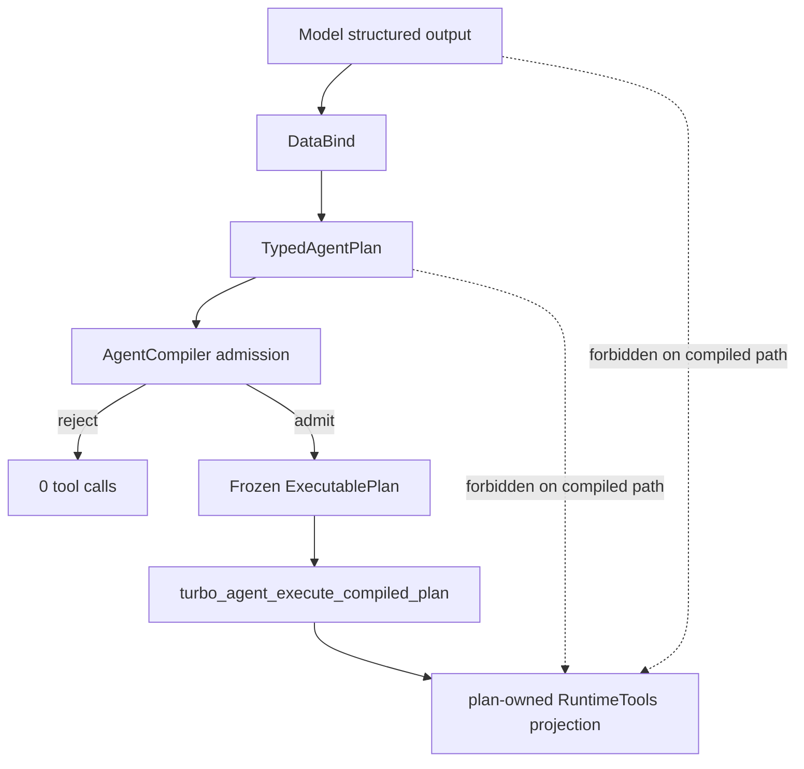

# Agent Compiler compile-before-execute boundary

Tracked by:

- TurboAgent #31 — Phase 1 compiler MVP
- TurboAgent #36 — boundary qualification

## Guarantee

The Agent Compiler guarantee applies to the **new compiled-plan execution path**:



It does **not** claim that low-level RuntimeTools APIs are globally inaccessible.
Explicit host code, backend adapters and focused tests may call RuntimeTools
directly.

The important distinction is:

```text
model-originated data != execution authority

frozen ExecutablePlan = execution authority for the compiled path
```

## Bypass audit

Audit performed while introducing the Phase-1 AgentCompiler target.

| Call site | Classification | Reason / migration |
| --- | --- | --- |
| `agent_compiler/src/turbo_agent_compiler.c` -> `turbo_tool_registry_execute_json_value_with_context` | **compiled path** | The only RuntimeTools dispatch in the new compiler surface. It consumes a plan-owned one-tool projection and frozen arguments. |
| `langchain/src/turbo_agent_workflow_tool_node.c` + `turbo_agent_tool_executor.c` | **legacy model path** | Existing Agent loop preflights policy/guardrails and then dispatches model tool calls. It is not Phase-1 compiler-qualified and must never be used as an implicit fallback by `AgentCompiler`. A later migration may compile batches before this executor or replace its source authority. |
| `langchain/src/turbo_chain.c` tool step | **legacy chain path** | Generic chain API can execute tool requests from chain/model state. Preserve for compatibility, but do not treat it as satisfying compiler qualification. |
| `langchain/src/turbo_langchain.c::turbo_langchain_tool_invoke*` | **explicit compatibility/host API** | Thin LangChain compatibility facade over RuntimeTools. It is caller-driven, not an automatic compiled model path. Retain until the LangChain-identity migration removes/replaces the facade. |
| `runtime_tools/src/*` | **host/backend infrastructure** | Canonical low-level execution primitives. They intentionally remain callable by trusted host code and runtime adapters. |
| `praktor_tools/tests/*`, `mcp_tools/tests/*`, `coding_tools/tests/*`, `llm_sandbox/tests/*`, `runtime_tools/tests/*` | **test-only** | Direct execution is intentional to qualify each backend independently. |
| `langchain/tests/*` direct registry calls | **test-only / legacy-surface qualification** | These tests exercise current public legacy APIs and are not the compiled-path contract. |
| `langchain/docs/workspace-skills-tools.md` direct Wasm registry example | **host example** | Demonstrates explicit host composition, not model execution authority. |

## No-fallback rule

The compiled path must never do this:

```text
compile fails
  -> silently send original model tool call to legacy Agent/Chain executor
```

Failure to compile is terminal for that plan version. The Harness may request a
new model/replan turn, but that creates a **new source plan and new compilation**.

## Freeze/lifetime rule

`ExecutablePlan` owns/copies every mutable source semantic fact:

- template identity is resolved to an immutable built-in descriptor;
- step/tool strings are copied;
- arguments are deep-cloned;
- capability names are copied and sorted;
- execution policy is copied;
- plan hash/certificate derive from those frozen facts.

The plan owns a RuntimeTools projection that copies tool metadata but borrows the
underlying callback implementation state from the source registry. Therefore the
source registry/provider lifetime must outlive the plan. This is a provider
lifetime dependency, **not source-plan semantic authority**.

## Phase-1 qualification matrix

The dedicated AgentCompiler tests must keep these properties true:

| Case | Compile result | Tool invocations |
| --- | --- | ---: |
| malformed JSON | source invalid | 0 |
| structurally wrong JSON | source invalid | 0 |
| unknown tool | unresolved | 0 |
| unlisted/unknown capability | denied | 0 |
| known but host-denied capability | denied | 0 |
| legacy tool with no capability metadata and no `custom_tools` admission | denied | 0 |
| Inspect + non-read-only tool | template violation | 0 |
| source mutated after successful compile | compiled semantics unchanged | exactly admitted call |
| valid Inspect plan | success | exactly 1 |

## Future migration

Phase 3 may route finite multi-step plans through Praktor HostTool. The same
authority rule remains:

```text
Model -> compile -> finite ExecutablePlan/WorkflowPlan -> execute

never:

Praktor DAG -> hidden model call -> continue same plan
```

A semantic failure requiring reasoning returns `REPLAN_REQUIRED` to the Harness;
the Harness/model produces a new source plan that must pass compilation again.
