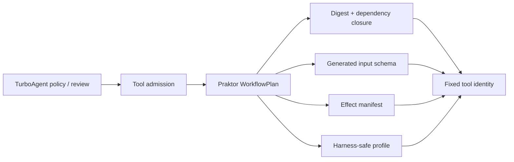
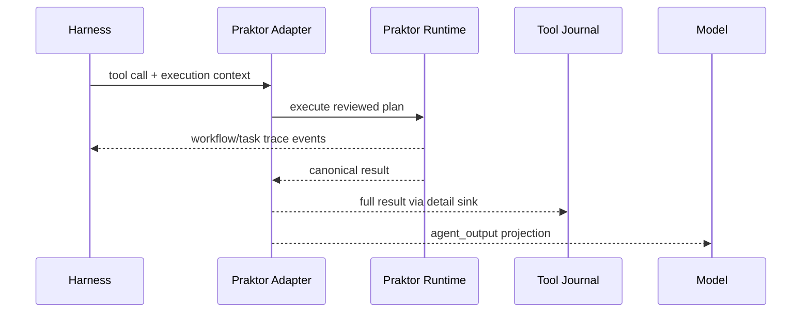

# Praktor Tool Pack Design

## Decision context

TurboAgent owns model interaction, tool policy, approvals, durable
thread/run/checkpoint state, tool journaling, and bounded tool execution.
Praktor owns deterministic YAML workflow orchestration.

The integration must not create a second agent state machine or let model input
select executable workflow files.

## Selected boundary

Each host-reviewed YAML workflow is registered as one ordinary TurboAgent tool.

With a WorkflowPlan-capable Praktor SDK, registration compiles the YAML into an
immutable/revalidatable plan and binds the plan identity to the tool:

The workflow path is host registration state and never appears in model
arguments. Older Praktor SDKs fall back to the existing reviewed absolute-path
binding.

## Alternatives

### One generic run(path, inputs) tool

Rejected. It makes filesystem path selection model-controlled and collapses
workflows with different side effects into one policy identity.

### Make Praktor an Agent runtime

Rejected. It would duplicate TurboAgent thread/turn/checkpoint and policy state.
Praktor remains an execution backend only.

### Register one tool per reviewed workflow

Selected. Tool identity, schema, execution policy, capability requirements, and
reviewed plan are fixed before inference.

## Ownership and lifecycle

| Item | Contract |
|---|---|
| Pack | owns one tool registry and the linked Praktor API view |
| Workflow binding | owns an immutable WorkflowPlan when available; otherwise copies the reviewed absolute path |
| Tool schema/name/description | copied by the Tool Registry |
| Model arguments | borrowed for one callback and serialized as workflow inputs |
| Praktor full result | published to Tool Execution Context v2 detail sink, then released |
| Model-facing result | `agent_output` when provided by Praktor; canonical result is the legacy fallback |
| Lifecycle events | translated from Praktor events into canonical Turbo trace events |
| Destruction | releases the WorkflowPlan before destroying the binding |

## Execution control and observability

TurboAgent Tool Definition v4 is context-aware. Tool Execution Context v2
carries:

- cancel token;
- monotonic deadline;
- thread/run/turn/tool-call lineage;
- canonical event sink;
- full-detail sink.

The adapter maps cancel/deadline into Praktor execution control. When Praktor
exposes lifecycle events, it calls observed WorkflowPlan execution and forwards
lineage without injecting those values into workflow variables.

The Tool Executor serializes event-sink delivery across parallel tool workers
and persists backend detail in the durable tool journal. Committed replay
restores compact output and detail without re-running side effects.

## Policy boundary

Every workflow requires `runtime_tools`.

With WorkflowPlan metadata, Praktor effects map conservatively into TurboAgent
policy capabilities:

| Praktor effect | TurboAgent capability |
|---|---|
| `network` | `network` |
| `process`, `system_control` | `shell` |
| `filesystem_write` | `patch` |
| `outside_workspace` | `outside_workspace` |
| `plugin`, `native_extension`, `model_api` | `custom_tools` |
| `filesystem_read` | no additional capability |

Unknown effects widen to the conservative legacy set plus `custom_tools`.
Host-supplied capability requirements are unioned with discovered effects and
therefore cannot narrow the Praktor analysis.

Without WorkflowPlan support, the legacy conservative set remains
`network + shell + patch + outside_workspace`.

## Harness-safe profile

Workflow config v2 enables `require_harness_safe` by default. When plan
metadata is available, registration requires
`profiles.harness_safe.qualified=true`.

The profile checks deterministic reviewability; it does not replace TurboAgent
policy. Network/process/system-control workflows can still qualify and remain
subject to the corresponding host capabilities and approvals.

Workflow config v1 remains accepted and stays on the legacy execution path.

## Result semantics

Praktor success and workflow-level failure are normal tool results.

For harness-native workflows, the canonical result is split:

- full `tasks` and diagnostic detail -> detail sink / durable journal;
- declared public `agent_output` -> model-facing tool result.

This avoids feeding raw task stdout/stderr to the model unless the workflow
explicitly exports it.

Negative request/plan/contract ABI errors are converted to structured error
objects containing `workflow_status=error`, result code, error phase, and
message. Plan mismatch is detected before workflow side effects.

## Capacity and compatibility

- `max_workflows` is a hard registration bound.
- `max_result_bytes` bounds the canonical Praktor result before projection.
- Tool Execution Context ABI v1 remains accepted; v2 adds observation sinks.
- Workflow config ABI v1 remains accepted; v2 adds harness-safe admission.
- Praktor WorkflowPlan/events are feature-detected at compile/runtime boundaries.
- Older released Praktor SDKs retain conservative reviewed-path behavior.

The module remains optional behind `ENABLE_PRAKTOR_TOOLS`.
