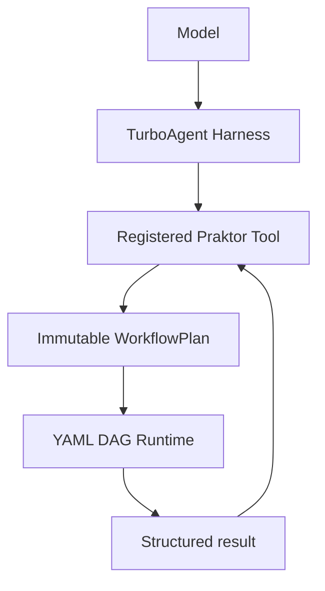

# TurboAgent Praktor Tools

`TurboAgent::PraktorTools` exposes reviewed [Praktor](https://github.com/qigao/praktor)
workflows as deterministic macro-tools for the TurboAgent harness.



TurboAgent owns model turns, policy, approvals, durable thread/run state, and
replanning. Praktor owns deterministic workflow execution.

The model never supplies a workflow path.

## Build

```cmake
-DENABLE_PRAKTOR_TOOLS=ON
-DPRAKTOR_ROOT=/path/to/praktor/install
```

Praktor support is optional. When enabled, `find_package(Praktor CONFIG REQUIRED)`
must resolve the installed SDK and its transitive native dependencies.

## Register a workflow

A harness-native workflow owns its public contract:

```yaml
input_policy: strict

inputs:
  preset:
    type: string
    required: true

outputs:
  artifact:
    type: string
    required: true
    value: "{{ tasks.package.outputs.path }}"

tasks:
  - name: package
    command: "./build-and-package {{ preset }}"
```

Registration can therefore omit a duplicate hand-authored tool schema:

```c
turbo_praktor_tool_pack_config_t pack_config;
turbo_praktor_workflow_config_t workflow;
turbo_praktor_tool_pack_t *pack;

turbo_praktor_tool_pack_config_init(&pack_config);
pack = turbo_praktor_tool_pack_create(&pack_config);

turbo_praktor_workflow_config_init(&workflow);
workflow.tool_name = "praktor_build";
workflow.description = "Build and package the current project.";
workflow.workflow_path = "/opt/workflows/build.yml";

turbo_praktor_tool_pack_add_workflow(pack, &workflow);
```

With a WorkflowPlan-capable Praktor SDK the adapter:

1. compiles and owns the reviewed WorkflowPlan;
2. registers the generated input schema;
3. checks the harness-safe profile;
4. derives policy capabilities from the effect manifest;
5. executes the bound plan rather than re-selecting a path.

Older Praktor SDKs automatically use the legacy reviewed-path behavior.

## Policy

`runtime_tools` is always required. Plan effects are mapped conservatively:

- network -> `network`
- process/system control -> `shell`
- filesystem write -> `patch`
- outside-workspace access -> `outside_workspace`
- plugin/native/model-provider effects -> `custom_tools`

Host-supplied requirements are additional: they cannot remove capabilities
derived from the workflow.

Unknown effects widen admission to conservative requirements instead of silently
narrowing policy.

Workflow config v2 requires `profiles.harness_safe.qualified=true` by default.
Set `require_harness_safe = 0` only for an explicitly reviewed compatibility
workflow. Config v1 callers retain legacy behavior.

## Cancellation, deadlines, events, and lineage

TurboAgent Tool Definition v4 receives Tool Execution Context v2. The adapter
propagates:

- cancellation;
- deadlines;
- `thread_id`;
- `run_id`;
- `turn_id`;
- `tool_call_id`.

When supported by Praktor, workflow/task lifecycle callbacks become canonical
Turbo trace events.

No lineage field is injected into workflow variables.

## Result split

Praktor keeps two result surfaces:

```text
canonical full result
  ├─ tasks / stdout / stderr / diagnostics -> detail sink -> tool journal
  └─ agent_output                         -> model-facing tool result
```

The model therefore receives only declared public outputs (or a compact
structured failure) while full execution evidence remains available to the
harness.

If an older Praktor result has no `agent_output`, the adapter returns the
canonical result for backward compatibility.

## Immutable review

WorkflowPlan binds the root workflow and transitive reviewed dependencies by
content digest. If those bytes change after registration, execution fails with
a plan mismatch before task side effects.

This is the central harness invariant:

> one reviewed workflow = one stable tool identity

The registry can be attached directly to an agent or composed with MCP, Wasm,
coding, and native tool registries through `turbo_tool_registry_compose()`.
